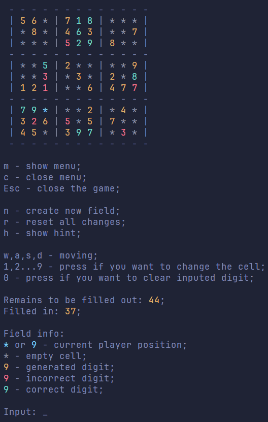
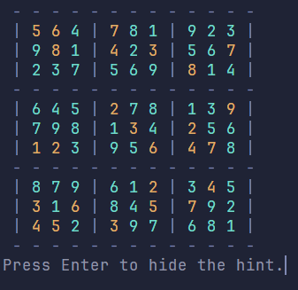

<h1 align="center">Sudoku</h1>

<h3 align="center">A console C++ game with the user-friendly graphics and a description of how to play</h3>

	
	

## Experience

I have practised: SRP, decomposition, clear naming, Google code style and usage of multi-dimensional arrays.